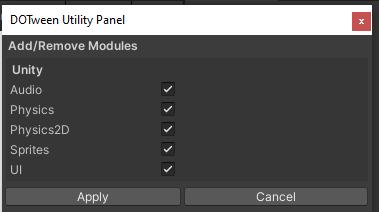
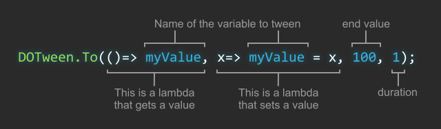
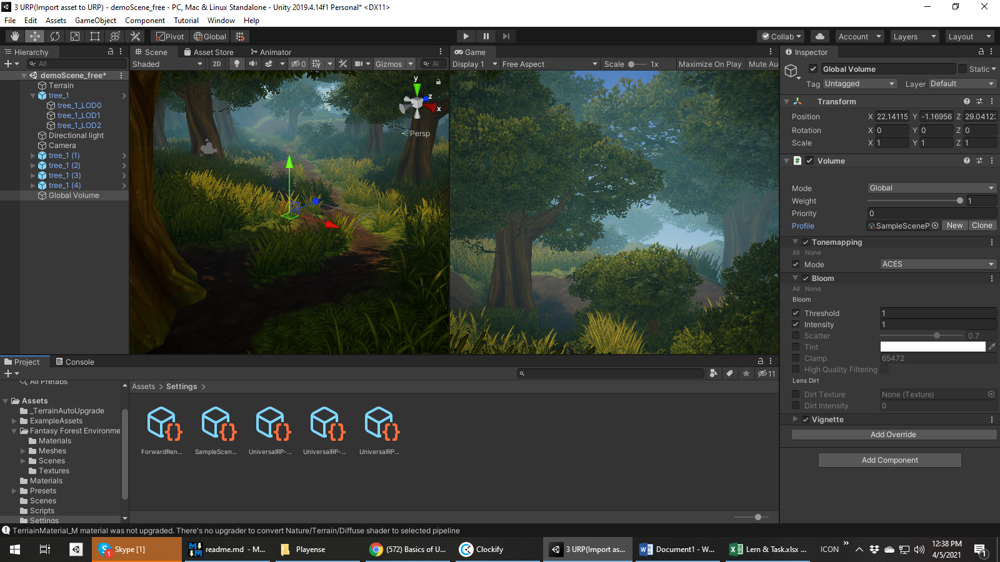
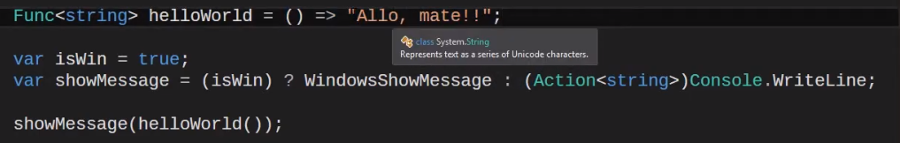
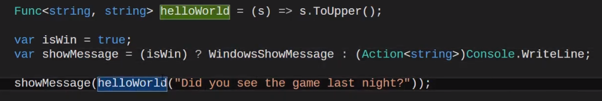
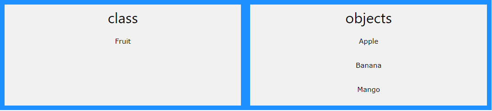
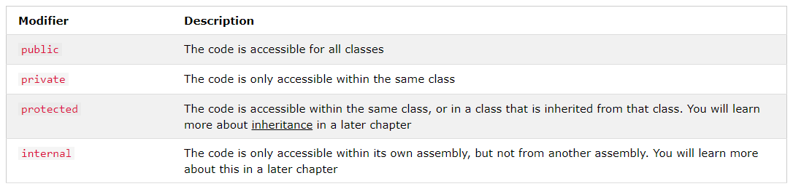
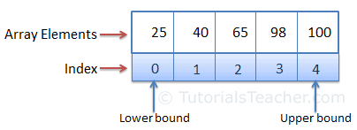

# Basic knowledge of Software Technology, Programming Concept (OOP, C#), Game Development (Unity).


* What is Game Engine, How its works
* What is the difference between game engine and other IDE
* What is Unity, 
* Why you chose Unity
* Tell me few game engine names
* Unity vs Unreal Engine vs Cocos
* What is Gameobject
* what is Prefab
* what is Shader Graph
* what is URP
* What is Monobehaviour

# Inheritance
* Super Sub, Virtual Override

# What is an abstract class?
* An abstract class is a class that is declared abstract —it may or may not include abstract methods. Abstract classes cannot be instantiated, but they can be subclassed. When an abstract class is subclassed, the subclass usually provides implementations for all of the abstract methods in its parent class.
* Abstract class is a restricted class that cannot be used to create objects (to access it, it must be inherited from another class). Abstract method: can only be used in an abstract class, and it does not have a body.

# Abstract Method
* C#: An Abstract method is a method without a body. The implementation of an abstract method is done by a derived class. When the derived class inherits the abstract method from the abstract class, it must override the abstract method. This requirment is enforced at compile time and is also called **dynamic polymorphism**.

* An abstract method is a method that is declared, but contains no implementation. Abstract classes cannot be instantiated, and require subclasses to provide implementations for the abstract methods.

# Static Variable
* Static variables are those variables whose values are shared among all the instance or object of a class. When we define any variable as static, it gets attached to a class rather than an object. The memory for the static variable will be allocation during the class loading time.

# Static Method
Static methods, much like class methods, are methods that are bound to a class rather than its object. They do not require a class instance creation. So, they are not dependent on the state of the object. ... Class method works with the class since its parameter is always the class itself.
```csharp
Console.WriteLine(Math.Sqrt(16));
```

# Static Class
* A static class in C# is a class that cannot be **instantiated**. A static class can only contain static data members including static methods, static constructors, and static properties.

# C# Console
* Press Ctrl+F5, to run C# project with hanging prompt
* [Method are Static](https://stackoverflow.com/questions/1685692/c-sharp-console-application-static-methods) : Member functions don't have to be static; but if they are not static, that requires you to instantiate a Program object in order to call a member method.

# Create a new class in C# console
Go to solution explorer MBR click on project name, ad a c# class, we can access this newly created class by creating an object of the class. you can create a static class and static method to access them by dot(.).
```csharp
class Book
   {
   }
```

```csharp
Boob book1 = new Book();
book1.title = "Adventure of Shahanama";
```
# Why do we need getter and setter if we can save value directly?
we need getter and setter to validate data from constructor/users
```csharp
class Movie
   {
       public string name;
        private string rating;
        public static int movieCount;
        public Movie(string title, string rateus)
        {
            this.name = title;
            this.Rating = rateus;
            movieCount++;
        }
       public string Rating
       {
           get { return rating; }
           set {
           if(value == "G"|| value == "PG")
               {
                   rating = value;
               }
               else
               {
                   rating = "NR";
               }
           }
       }
   }
```
```csharp
static void Main(string[] args)
        {

            Movie movie1 = new Movie("Avengers", "doge");
            Console.WriteLine(movie1.Rating);
        }
        // output NR
```

# Class with Multiple Constructor
```csharp
class Book
   {
       public string title;
       public Book(){
       }
       }
       public Book(string name)
       {
          this.title = name;
          Console.WriteLine("Book tile is " + name);
       }
       
   }
```
```csharp
Book book1 = new Book();
Book book2 = new Book("Harry Potter");
```

# Example of Try Catch
```csharp
            try
           {
               int number = Convert.ToInt32(Console.ReadLine());
           }
           catch(Exception e)
           {
               Console.WriteLine("Error " + e.Message);
           }
```

# Print a grid of row 5, column = 7
```csharp
static void Grid(int row, int column)
        {
            for (int i = 0; i < row; i++)
            {
                for (int j = 0; j < column; j++)
                {
                    Console.Write($"({i},{j}); ");
                    }
                Console.Write("\n");
            }
        }
(0,0); (0,1); (0,2); (0,3); (0,4); (0,5); (0,6);
(1,0); (1,1); (1,2); (1,3); (1,4); (1,5); (1,6);
(2,0); (2,1); (2,2); (2,3); (2,4); (2,5); (2,6);
(3,0); (3,1); (3,2); (3,3); (3,4); (3,5); (3,6);
(4,0); (4,1); (4,2); (4,3); (4,4); (4,5); (4,6);
```

# Write a program that print a sequential tuple series with negative values?
```csharp
for (int i = 1; i < 24; i++)
           {
               int value = (int) i / 2;
               Console.Write(Math.Pow(-1, i) * value + "\n");
           }
           //0, 1, -1, 2, -2, 3, -3, 4, -4, 5, -5, 6, -6, 7, -7, 8, -8, 9, -9, 10, -10, 11, -11,
```

# What is a programming?
Programming is the process of creating a set of **instructions** that tell a computer how to perform a task

# What is a programming framework?
* A programming framework is a **prepackaged** set of solutions that solves common development problems

# What is .NET Framework
The .NET Framework is a software framework developed by Microsoft that runs primarily on Microsoft Windows. It includes a large class library called Framework Class Library and provides language interoperability across several programming languages

# Which will called first in Unity ? OnEnable or Awake
* Awake will be called first, Awake will be called when a GameObject is created or a prefab is instantiated. OnEnable will be called when a GameObject gets enabled. <br>
*Awake will be called once where OnEnable will be called many times. When an object is reactivated OnEnable will be called.*

# What is MonoBehaviour [more](https://docs.unity3d.com/ScriptReference/MonoBehaviour.html)
MonoBehaviour is the base class from which every Unity script derives.
When you use C#, you must explicitly derive from MonoBehaviour. MonoBehaviour called its event function as predefined way, say : Awake() Start() Update() FixedUpdate() LateUpdate() OnGUI() OnDisable() OnEnable() etc

# What is FPS & Application Target Frame Rate [more](https://docs.unity3d.com/ScriptReference/Application-targetFrameRate.html)

Instructs the game to try to render at a specified frame rate.

The default targetFrameRate is a special value of -1, which indicates that the game should render at the platform's default frame rate. This default rate depends on the platform:

- On standalone platforms the default frame rate is the maximum achievable frame rate.

- **On mobile platforms the default frame rate is less than the maximum achievable frame rate due to the need to conserve battery power. Typically on mobile platforms the default frame rate is 30 frames per second**.

- All mobile platforms have a fix cap for their maximum achievable frame rate, that is equal to the refresh rate of the screen (60 Hz = 60 fps, 40 Hz = 40 fps, ...). **Screen.currentResolution** contains the screen's refresh rate.

 ```csharp
 // Make the game run as fast as possible
Application.targetFrameRate = 300;
```
# event functions :
# Awake
This function is always called before any Start functions and also just after a prefab is instantiated. (If a GameObject is inactive during start up Awake is not called until it is made active.)

Awake is the first thing that is called when an object is activated. This makes it useful for **setting up the game object itself. It is not, however, the place to reference other objects as they may not be active yet.**


# OnEnable
(only called if the Object is active): This function is called just after the object is enabled. This happens when a MonoBehaviour **instance is created**, such as when a **level is loaded** or a GameObject with the script component is instantiated.

##### OnEnabled is unique because it is called every time the game object is enabled no matter how many times this happens. Put code here that needs to be executed each time the object is activated.

# Start
Start is called before the first frame update only if the script instance is enabled. Start is only ever called once for a giver script.

# [Time](https://docs.unity3d.com/ScriptReference/Time.html)
The interface to get time information from Unity.

# DeltaTime vs fixedDeltaTime
##### Time.DeltaTime
Depends on frame rate (Frame rate depends on Screen Refresh Rate, Screen Refresh Rate(Hz) depends on Screen Resolution )
0.0059693
0.0063711
0.0058189

##### Time.fixedDeltaTime
Always Constant (Set in Settings->Time->Time Stamp)
0.02
##### fixedTime
The time the latest FixedUpdate has started (Read Only) Increment by fixedDeltaTime.
4.16
4.18
##### timeScale
The scale at which time passes. This can be used for slow motion effects.
# FPS
```csharp
1.0f / Time.deltaTime
```


# Update
Update is called **once per frame**. It is the main workhorse function for frame updates.

# LateUpdate
LateUpdate is called once per frame, after Update has finished. Any calculations that are performed in Update will have completed when LateUpdate begins. A common use for LateUpdate would be a **following third-person camera**. If you make your character move and turn inside Update, you can perform all camera movement and rotation calculations in LateUpdate. This will ensure that the character has moved completely before the camera tracks its position.

# [FixedUpdate()](https://docs.unity3d.com/ScriptReference/MonoBehaviour.FixedUpdate.html)

FixedUpdate is often called more frequently than Update. It can be called multiple times per frame, if the frame rate is low and it may not be called between frames at all if the frame rate is high. All physics **calculations and updates** occur immediately after FixedUpdate. When applying movement calculations inside FixedUpdate, you do not need to multiply your values by Time.deltaTime. This is because FixedUpdate is called on a reliable timer, independent of the frame rate.


<small>Details: Frame-rate independent MonoBehaviour. FixedUpdate message for physics calculations.

MonoBehaviour.FixedUpdate has the frequency of the physics system; it is called every fixed frame-rate frame. Compute Physics system calculations after FixedUpdate. 0.02 seconds (50 calls per second) is the default time between calls. Use Time.fixedDeltaTime to access this value. Alter it by setting it to your preferred value within a script, or, navigate to Edit > Settings > Time > Fixed Timestep and set it there. The FixedUpdate frequency is more or less than Update. If the application runs at 25 frames per second (fps), Unity calls it approximately twice per frame, Alternatively, 100 fps causes approximately two rendering frames with one FixedUpdate. Control the required frame rate and Fixed Timestep rate from Time settings. Use Application.targetFrameRate to set the frame rate.

Use FixedUpdate when using Rigidbody. Set a force to a Rigidbody and it applies each fixed frame. FixedUpdate occurs at a measured time step that typically does not coincide with MonoBehaviour.Update.</small>

# Profiler overview
The Unity Profiler is a tool you can use to get performance information about your application. You can connect it to devices on your network or devices connected to your machine to test how your application runs on your intended release platform. You can also run it in the Editor to get an overview of resource allocation while you’re developing your application. To access the Profiler window go to menu: Window > Analysis > Profiler

# Script Execution Order
You cannot specify the order in which an event function is called for different instances of the same MonoBehaviour subclass. You can specify that the event functions of one MonoBehaviour subclass should be invoked before those of a different subclass (using the Script Execution Order panel of the Project Settings window).

# [Update vs Fixedupdate](https://stackoverflow.com/questions/34447682/what-is-the-difference-between-update-fixedupdate-in-unity#:~:text=Update%20runs%20once%20per%20frame,fast%2Fslow%20the%20framerate%20is.)
Update runs once per frame. FixedUpdate can run once, zero, or several times per frame, depending on how many physics frames per second are set in the time settings, and how fast/slow the framerate is

FixedUpdate is used for being in-step with the physics engine, so anything that needs to be **applied to a rigidbody** should happen in FixedUpdate. Update, on the other hand, works independantly of the physics engine. This can be benificial if a user's framerate were to drop but you need a certain calculation to keep executing, like if you were updating a **chat or voip client**, you would want regular old update.

# Unity state machine
In Unity, you can create an asset called an Animator Controller. This is a state machine template. There are states inside your state machine. ... To run your state machine, add a component called Animator to a GameObject and set it up with any Animator Controller that you've created

# Animation update loop
Out of Control 


# Rendering
**OnPreCull**: Called before the camera culls the scene. Culling determines which objects are visible to the camera. OnPreCull is called just before culling takes place.
OnBecameVisible/OnBecameInvisible: Called when an object becomes visible/invisible to any camera.
**OnWillRenderObject**: Called once for each camera if the object is visible.
**OnPreRender**: Called before the camera starts rendering the scene.
**OnRenderObject**: Called after all regular scene rendering is done. You can use GL class or Graphics.DrawMeshNow to draw custom geometry at this point.
**OnPostRender**: Called after a camera finishes rendering the scene.
**OnRenderImage**: Called after scene rendering is complete to allow post-processing
 of the image, see Post-processing Effects.
**OnGUI**: Called multiple times per frame in response to GUI events. The Layout and Repaint events are processed first, followed by a Layout and keyboard/mouse event for each input event.
**OnDrawGizmos**: Used for drawing Gizmos
 in the scene view
 for visualisation purposes.

# Coroutines
Normal coroutine updates are run after the Update function returns. A coroutine is a function that can suspend its execution (yield) until the given YieldInstruction finishes. Different uses of Coroutines:

**yield** The coroutine will continue after all Update functions have been called on the next frame.
**yield WaitForSeconds** Continue after a specified time delay, after all Update functions have been called for the frame.
**yield WaitForFixedUpdate** Continue after all FixedUpdate has been called on all scripts. If the coroutine yielded before FixedUpdate, then it resumes after FixedUpdate in the current frame.
**yield WWW** Continue after a WWW download has completed.
**yield StartCoroutine** Chains the coroutine, and will wait for the MyFunc coroutine to complete first.

```csharp
//its refresh the coroutine for next update ie this coroutine will perform again at the next update
yeild return null;
// while(condition) me if condition is satisfied , the coroutine will execute.

```

## IEnumerator
IEnumerator is a . NET type that is used to fragment large collection or files, or simply to pause an iteration. Coroutine is a Unity type that is used to create parallel actions returning a IEnumerator to do so

*When the Object is destroyed*
**OnDestroy**: This function is called after all frame updates for the last frame of the object’s existence (the object might be destroyed in response to Object.Destroy or at the closure of a scene).

*When quitting*
These functions get called on all the active objects in your scene:

**OnApplicationQuit**: This function is called on all game objects before the application is quit. In the editor it is called when the user stops playmode.
**OnDisable**: This function is called when the behaviour becomes disabled or inactive.


# [Threads](https://support.unity.com/hc/en-us/articles/208707516-Why-should-I-use-Threads-instead-of-Coroutines-)

##### Unity has a functionality called Coroutines that can be a substitution for Threads in some cases.
##### Unity Coroutines use concurrency and Threads use parallelism.

### When threads are useful to use: 

When you are computing some expensive and/or long-term operations, Threads can still be useful. Examples of this are:
* AI
* Pathfinding
* Network communication
* Files operations 


# Order of execution for event functions
[ click here](https://docs.unity3d.com/2019.4/Documentation/Manual/ExecutionOrder.html)

***********************************************

# [DoTween](http://dotween.demigiant.com/getstarted.php)
## [Download and Setup DoTween Package in unity](http://dotween.demigiant.com/getstarted.php)
*Import from Asset Store, Go to DoTween Utility Panel -> Setup*
 
 

##  What is tweening
 **Inbetweening**, also commonly known as tweening, is a process in animation that involves generating intermediate frames, called inbetweens, between two keyframes. The intended result is to create the illusion of movement by smoothly transitioning one image into another
 
 ## Tweener 
 A tween that takes control of a value and animates it.
 ## Sequence
 A special tween that, instead of taking control of a value, takes control of other tweens and animates them as a group.
 ## Tween
 A generic word that indicates both a Tweener and a Sequence.
 ## Nested tween
 A tween contained inside a Sequence.
 
##### Do:
Prefix for all tween
##### Set:
Prefix for all settings
##### On:
Prefix for all callbacks

  
  
 ##### Basic Code Structure
 ```csharp
// The shortcuts way
transform.DOMove(new Vector3(2,2,2), 1);
// The generic way
DOTween.To(()=> transform.position, x=> transform.position = x, new Vector3(2,2,2), 1);
```
##### Practice
```csharp
// (DG stands for Demigiant, Tweening for, uh, tweening)
using System.Collections;
using System.Collections.Generic;
using UnityEngine;
using DG.Tweening;

public class DoTweenMaruf : MonoBehaviour
{
    public Vector3 movePostion = Vector3.zero;
    public Vector3 gameObjectPosition = Vector3.zero;
    public float moveSpeed = 1.0f;
    public Ease ease = new Ease();
    private Material material;
    float i = 0;
    private void Start()
    {
        material = gameObject.GetComponent<Renderer>().material;
    }
    void Update()
    {
       if( Input.GetKeyDown(KeyCode.Space)){


            /*1 Basic movement*/
            gameObject.transform.DOMove(movePostion, moveSpeed).SetEase(ease);
            material.DOColor(Color.blue, 0);
            material.DOFade(0.5f, 2);  ALPHA:  works on supported material
              transform.DOLocalRotate(new Vector3(0, 180, 0), 1);

             i++;
             transform.DORotateQuaternion(Quaternion.Euler(0, 36*i, 0), i);

            /* 2. Sequence*/
             DOTween.Sequence()
                 .Append(gameObject.transform.DOMove(movePostion, moveSpeed).SetEase(ease))
                 .Append(gameObject.GetComponent<Renderer>().material .DOColor(Color.red, 1))
                .Append(gameObject.transform.DOMove(gameObjectPosition, moveSpeed).SetEase(ease));

            /* 3a Loop and Complete another function*/
            transform.DOMove(new Vector3(2, 2, 2), 2)
                .SetEase(Ease.OutQuint)
                .SetLoops(4)
                .OnComplete(myFunction);

            /* 3b Same as above but storing the tween and applying settings without chaining*/
            Tween myTween = transform.DOMove(new Vector3(2, 2, 2), 2);
            myTween.SetEase(Ease.OutQuint);
            myTween.SetLoops(4);
            myTween.OnComplete(myFunction);

            /* 4 You can even copy all settings from one tween to another, using SetAs():*/

             Tween myTween = transform.DOMove(new Vector3(2, 3, 4), 2)
              .SetEase(Ease.OutQuint)
            .OnComplete(myFunction);

             material.DOColor(Color.blue, 1).SetAs(myTween);


             5. Callback without parameters
             transform.DOMoveX(4, 1).OnComplete(myFunction);  1
             transform.DOMoveX(4, 1).OnComplete(() => myCallback("Maruf") );
            /*Similar to Swift Completion handler*/
            transform.DOMoveX(4, 1).OnComplete(() => {
                myCallback("Maruf");
            })
                .SetSpeedBased(true) ;


            /*6 TweenParams + infinite looping*/
        
            TweenParams tParms = new TweenParams().SetLoops(-1).SetEase(Ease.OutElastic);
            transform.DOMoveX(15, 1).SetAs(tParms);

            transform.DOMoveX(4, 1).OnUpdate(myFunction);  Sets a callback that will be fired every time the tween updates.

        }
    }

    private void myFunction()
    {
        Debug.Log(" on completion");
    }
    private void myCallback(string name)
    {
        Debug.Log($"{name.Length}");
    }
}


```
# Tween Caution: 
```csharp
DOTween.Init(autoKillMode, useSafeMode, logBehaviour);
```

When you create a tween it will play automatically (unless you change the global defaultAutoPlay behaviour) until it completes all its loops.

When a tween is complete it is automatically killed (unless you change the global defaultAutoKill behaviour), which means you won't be able to use it anymore.

If you want to reuse the same tween, just set its autoKill behaviour to FALSE (either by changing the global autoKill settings for all tweens, or by chaining SetAutoKill(false) to your tween).

If your tween's target becomes NULL while a tween is playing errors might happen. You'll have to either be careful or activate the safe mode

 *****************************************************
 
# [Render pipelines ](https://www.youtube.com/watch?v=HqaQJfuK_u8)
A render pipeline performs a series of operations that take the contents of a Scene, and displays them on a screen. At a high level, these operations are:

* Culling
* Rendering
* Post-processing


## Scriptable Render Pipeline fundamentals
Unity’s Scriptable Render Pipeline (SRP) is a feature that allows you to control rendering via C# scripts.SRP is the technology that underpins the Universal Render Pipeline (URP) and the High Definition Render Pipeline (HDRP).

**The Scriptable Render Pipeline is a thin API layer that lets you schedule and configure rendering commands using C# scripts. Unity passes these commands to its low-level graphics architecture, which then sends instructions to the graphics API.**

#  Universal Render Pipeline
<small>**The Universal Render Pipeline (URP) is a prebuilt Scriptable Render Pipeline**, made by Unity. URP provides artist-friendly workflows that let you quickly and easily create optimized graphics across a range of platforms, from mobile to high-end consoles and PCs. **An earlier version of URP was called the Lightweight Render Pipeline (LWRP). URP replaces LWRP.**</small>

# High Definition Render Pipeline
The High Definition Render Pipeline (HDRP) is a prebuilt Scriptable Render Pipeline, built by Unity. HDRP lets you create **cutting-edge, high-fidelity graphics for high-end platforms**.



# Project

* Create a new project using Universal RP.
* Import asset from your library/AssetStor.
* Convert Scene to Edit ->  Render Pipeline ->URP->Upgrade Project Material.
* If Some material still is not convert to URP Material go to Material Change its Shader -> URP->Sample Lit (As needed), Customize Material Setting. Important to Chose Base Map file & alpha 255


* Post Processing: Create Volume on the scene, Click Circle near Profiler, chose default SampleSceneProfile, Check Camera post processing option.
* Fog Settings: Windows->Renderer -> Light Settings : Other Settings -> Density 
* Multiple Volume: Add new Box Volume(Local) and add customize profiler(add Color Adjustment, change its saturation to -100, now navigate your camera to the volume to see the difference ) 


# Frame Debugger
Window > Analysis > Frame Debugger


# [Unity Object Pool](https://github.com/gitOpu/ObjectPooling_Unity)
An object pool provides an efficient way to reuse objects, and thus keep the memory foot print of all dynamically created objects within fixed bounds. This is crucial for maintaining consistent frame rates in real time games (especially on mobile), as frequent garbage collection spikes would likely lead to inconsistent performance.

# [Generics](https://learn.unity.com/tutorial/generics#)
Generics allow you to define the specification of the data type of programming elements in a class or a method, until it is actually used in the program. In other words, generics allow you to write a class or method that can work with any data type.
##### Generic Method

```csharp
public class Genric : MonoBehaviour
{
    public T GenricMethod<T>(T param)
    {
        return param;
    }
}
```
##### Generic Class
```csharp
public class GenricClass <T>
{
    private T item;
    public void Capacity(T param)
    {
        item = param;
    }
}
```
##### Generic Class and Method Instantiate from another class
```csharp
public class GenricExample : MonoBehaviour
{
void Start()
    {
        Genric genric = new Genric();
        int currentValue = genric.GenricMethod<int>(5);
        Debug.Log(currentValue);

        GenricClass<int> genricClass = new GenricClass<int>();
        genricClass.Capacity(5);
    } 
}
```


# Func (delegate)



Action: "I don't expect the method returns a value"
Func: "I expect the method to return a value of Type T"
Predicate: "I expect the Func to return a bool"
Delegate: "Any of the above and allows to use ref and out paramters"


# Dictionary
```csharp
Dictionary<string, string> openWith =
    new Dictionary<string, string>();
```


# [C#](https://www.tutorialsteacher.com/csharp/csharp-indexer)

C# has roots from the C family, and the language is close to other popular languages like C++ and Java.

The first version was released in year 2002. The latest version, C# 8, was released in September 2019.

# Break vs Continue
The break statement use to jump out /Exit of a loop.

The continue statement breaks one iteration (in the loop), if a specified condition occurs, and continues with the next iteration in the loop.
# Method
A method is a block of code which only runs when it is called.

You can pass data, known as parameters, into a method.
# Function
Methods are used to perform certain actions, and they are also known as functions.


 

Problem
Profiler, Frame Debugger, Customize Render Pipeline

# OOP
Object-oriented programming (OOP) is a computer programming architecture that organizes software design around data, or objects, rather than functions and logic. An object can be defined as a data field that has unique attributes and behavior.

Procedural programming is about writing procedures or functions that perform operations on the data, while object-oriented programming is about creating objects that contain both data and functions.

* OOP is faster and easier to execute
* OOP provides a clear structure for the programs
* OOP helps to keep the C++ code DRY "Don't Repeat Yourself", and makes the code easier to maintain, modify and debug
* OOP makes it possible to create full reusable applications with less code and shorter development time


# Classes and objects 

##### So, a class is a template for objects, and an object is an instance of a class.

When the individual objects are created, they inherit all the variables and methods from the class.



Everything in C# is associated with classes and objects, along with its attributes and methods. For example: in real life, a car is an object. The car has attributes, such as weight and color, and methods, such as drive and brake.

```csharp
class Car 
{
// Class members
  string color = "red";

  static void Main(string[] args)
  {
    Car myObj = new Car();
    Console.WriteLine(myObj.color);
  }
}
```

##### Class Members
Fields and methods inside classes are often referred to as "Class Members"


# [Constructors](https://www.w3schools.com/cs/cs_constructors.asp)
**A constructor is a special method that is used to initialize objects**. The advantage of a constructor, is that it is called when an object of a class is created. It can be used to set initial values for fields:
```csharp
class Car
{
  public string model;

  // Create a class constructor with a parameter
  public Car(string modelName)
  {
    model = modelName;
  }

  static void Main(string[] args)
  {
    Car Ford = new Car("Mustang");
    Console.WriteLine(Ford.model);
  }
}
```
* Note that the constructor name must match the class name, and it cannot have a return type
* All classes have constructors by default


# Namespace and Assembly ?

A .Net Namespace provides the fundamental unit of logical code grouping while an assembly provides a fundamental unit of physical code grouping.

##### Namespace
<small>Namespaces is a logical group of related classes that can be used by any other language targeting the Microsoft .Net framework . It is more used for logical organization of your classes. Namespaces are a way of grouping type names and reducing the chance of name collisions.</small>

##### Assembly
<small>An assembly is a collection of types and resources that are built to work together and form a logical unit of functionality. It is an Output Unit, that is .exe or .dll file. It is a unit of Deployment and a unit of versioning and also it contain MSIL (Microsoft Intermediate Language) code. Assemblies are self describing, it contains all the metadata about the modules, types, and other elements in the form of a manifest.</small>

# Access Modifiters
> public->All Class

> private -> Same Class

> protected -> Inherited Class Too

> Internal -> Same Assembly (Default)



##### Internal is the default if no access modifier is specified
 

# Properties (Get and Set)
The meaning of Encapsulation, is to make sure that "sensitive" data is hidden from users. To achieve this, you must:


Getters and setters are used to protect your data, particularly when creating classes. For each instance variable, a getter method returns its value while a setter method sets or updates its value. ... The getter method returns the value of the attribute. The setter method takes a parameter and assigns it to the attribute


* declare fields/variables as private
* provide public get and set methods, through properties, to access and update the value of a private field
* Fields can be made **read-only** (if you only use the get method), or **write-only** (if you only use the set method)
```csharp
public myclass {
  private int _score;
  public int MyScore {
     get { return _score; }
     set { _score = value; }
  }
}
// another approch
private x;
 public int getX()
 {
     return x;
 }
 
 public void setX(int newX)
 {
     if(newX < 0)
         x = 0;
     else
         x = newX;
 }

 // final approch
 
 class Thing {
  private int secret; // This is a field.

  public int Secret { // This is a property.
    get {
      Debug.Print("Somebody is accessing the secret!");
      return secret;
    }

    set {
      Debug.Print("Somebody is writing to the secret!");
      secret = value; // Note the use of the implicit variable "value" here.
    }
  }
}
// access from another method

Thing thing = new Thing();
thing.Secret = 23; // Use the setter.
Debug.Print("Set the secret to {0}.", thing.Secret); // Use the getter.

// short form
public int Secret { get; set; }


```


# Inheritance (Derived and Base Class)
Inheritance lets us inherit fields and methods from another class.

##### Derived Class (child) -
the class that inherits from another class

* **Base Class (parent)** the class being inherited from
* If you don't want other classes to inherit from a class, use the *sealed* keyword:
* <small> The following members are not inherited: **Static constructors**, which initialize the static data of a class.
**Instance constructors**, which you call to create a new instance of the class. Each class must define its own constructors.
**Finalizers**, which are called by the runtime's garbage collector to destroy instances of a class.
</small>

```csharp
// base classs
sealed class Vehicle 
{
  ...
}
// drive class
class Car : Vehicle 
{
  ...
}

```
# Polymorphism (virtual - override )
 Inheritance lets us inherit fields and methods from another class. Polymorphism uses those methods to perform different tasks. This allows us to perform a single action in different ways.
 ```csharp
class Animal  // Base class (parent) 
{
  public virtual void animalSound() 
  {
    Console.WriteLine("The animal makes a sound");
  }
}

class Pig : Animal  // Derived class (child) 
{
  public override void animalSound() 
  {
    Console.WriteLine("The pig says: wee wee");
  }
}

class Dog : Animal  // Derived class (child) 
{
  public override void animalSound() 
  {
    Console.WriteLine("The dog says: bow wow");
  }
}

class Program 
{
  static void Main(string[] args) 
  {
    Animal myAnimal = new Animal();  // Create a Animal object
    Animal myPig = new Pig();  // Create a Pig object
    Animal myDog = new Dog();  // Create a Dog object

    myAnimal.animalSound();
    myPig.animalSound();
    myDog.animalSound();
  }
}
```

 
# Why And When To Use "Inheritance" and "Polymorphism"?
- It is useful for code **reusability**: reuse fields and methods of an existing class when you create a new class.


# Abstraction
Data abstraction is the process of hiding certain details and showing only essential information to the user.   Abstraction can be achieved with either abstract classes or interfaces

# Abstract class 
An abstract class is a class that is declared **abstract**, it may or may not include **abstract methods**. Abstract classes **cannot be instantiated**, but they can **be subclassed**

##### Subclass
A class that is derived from another class is called a subclass

# Abstract method:
can only be used in an abstract class, and it does not have a body. The body is provided by the derived class (inherited from).

```csharp
abstract class Animal 
{
  public abstract void animalSound();
  public void sleep() 
  {
    Console.WriteLine("Zzz");
  }
}
```
# Why And When To Use Abstract Classes and Methods?
To achieve security - hide certain details and only show the important details of an object.

[Interface](https://github.com/gitOpu/ObjectPooling_Unity)

 
* Another way to achieve abstraction in C#, is with interfaces.
* An interface is a completely "abstract class", which can only contain abstract methods and properties (with empty bodies):
* It is considered good practice to start with the letter "I" at the beginning of an interface.
* By default, members of an interface are abstract and public.
*  Interfaces can contain properties and methods, but not fields.
* To access the interface methods, the interface must be "implemented" (kinda like inherited) by another class.
*  The body of the interface method is provided by the "implement" class.
* you do not have to use the override keyword when implementing an interface.
* On implementation of an interface, you must  write all of its methods bodies
* An interface cannot contain a constructor (as it cannot be used to create objects)
```csharp
 
// Interface
interface IAnimal 
{
  void animalSound(); // interface method (does not have a body)
}

// Pig "implements" the IAnimal interface
class Pig : IAnimal 
{
  public void animalSound() 
  {
    // The body of animalSound() is provided here
    Console.WriteLine("The pig says: wee wee");
  }
}

class Program 
{
  static void Main(string[] args) 
  {
    Pig myPig = new Pig();  // Create a Pig object
    myPig.animalSound();
  }
}
```

# [Practical Example](https://github.com/gitOpu/ObjectPooling_Unity)

```csharp
//1 defination
public interface IPooledObject  
{
    void OnObjectSpwan();
}
//2 mention when to execute
public class ObjectPooler : MonoBehaviour
{
public Dictionary<string, Queue<GameObject>> poolDictionary = new Dictionary<string, Queue<GameObject>>();
GameObject objectToSpawn =  poolDictionary[tag].Dequeue();
IPooledObject objectIsPooled = objectToSpawn.GetComponent<IPooledObject>();
        if(objectIsPooled != null)
        {
            objectIsPooled.OnObjectSpwan();
        }
}
//3 Method body create from another class     
public class Cube : MonoBehaviour, IPooledObject
{
public void OnObjectSpwan() {
    }
}
```

# Why And When To Use Interfaces?
1) To achieve security - hide certain details and only show the important details of an object (interface).

# Enums
C# enum is a value type with a set of related named constants often referred as an enumerator list. The C# enum keyword is used to declare an enumeration. It is a primitive data type, which is user-defined. Enums type can be an integer (float, int, byte, double etc.)

An enum is a special "class" that represents a group of constants (unchangeable/read-only variables).
* Enum is short for "enumerations", which means "specifically listed".

```csharp
enum Level 
{
  Low,
  Medium,
  High
}
```


# Struct  vs class
##### Usage : 
1) Structures provide better performance when we have small collections of value-types that you want to group together. 2) Use Structure if all member fields are of value type. Use Class if any one member is of reference type.

##### Struct
* Structs are value types, allocated either on the stack or inline in containing types.
* Allocations and de-allocations of value types are in general cheaper than allocations and de-allocations of reference types.
* In structs, each variable contains its own copy of the data (except in the case of the ref and out parameter variables), and an operation on one variable does not affect another variable.

##### Classes 
* Classes are reference types, allocated on the heap and garbage-collected.
* Assignments of large reference types are cheaper than assignments of large value types.
* In classes, two variables can contain the reference of the same object and any operation on one variable can affect another variable.

 In this way, struct should be used only when you are sure that,
* It logically represents a single value, like primitive types (int, double, etc.).
* It is immutable.
* It should not be boxed and un-boxed frequently.

```csharp
struct Location   
{  
    publicint x, y;  
    publicLocation(int x, int y)  
    {  
        this.x = x;  
        this.y = y;  
    }  
}  
Locationa = new Location(20, 20);  
Locationb = a;  
a.x = 100;  
System.Console.WriteLine(b.x)  
;
```


# Exceptions - Try..Catch
```csharp
try
{
  int[] myNumbers = {1, 2, 3};
  Console.WriteLine(myNumbers[10]);
}
catch (Exception e)
{
  Console.WriteLine(e.Message);
}
```
# Method Overloading
Two or more than two methods having the same name but different parameters is what we call method overloading in C#.


# IEnumerable
IEnumerable is an interface defining a single method GetEnumerator() that returns an IEnumerator interface. It is the base interface for all non-generic collections that can be enumerated. 


# [List<T>](https://www.tutorialsteacher.com/csharp/csharp-generics)
The List<T> is a collection of strongly typed objects that can be accessed by index and having methods for sorting, searching, and modifying list. It is the generic(Generic means the general form, not specific.) version of the ArrayList that comes under System.Collection.Generic namespace.

# Indexers
An indexer is a special type of property that allows a class or a structure to be accessed like an array for its internal collection.

# Heap?
The heap is a memory used by programming languages to store global variables. By default, all global variable are stored in heap memory space. It supports Dynamic memory allocation.

# [Key Differences between Stack and Heap](https://www.guru99.com/stack-vs-heap.html#:~:text=The%20heap%20is%20a%20memory,tightly%20managed%20by%20the%20CPU.)


# Array
A variable is used to store a literal value, whereas an array is used to store multiple literal values.

An array is the data structure that stores a fixed number of literal values (elements) of the same data type. Array elements are stored contiguously in the memory.



```csharp
string[] cars;
string[] cars = {"Volvo", "BMW", "Ford", "Mazda"};
int[] myNum = {10, 20, 30, 40};
```

# Indexers
An indexer is a special type of property that allows a class or a structure to be accessed like an array for its internal collection.

# [Dictionary](https://www.tutorialsteacher.com/csharp/csharp-dictionary) 
Dictionary<TKey,TValue> Class
Namespace: System.Collections.Generic

The Dictionary<TKey, TValue> is a generic collection that stores key-value pairs in no particular order.

* Dictionary Characteristics
* Dictionary<TKey, TValue> stores key-value pairs.
* Comes under System.Collection.Generic namespace.
* Implements IDictionary<TKey, TValue> interface.
* Keys must be unique and cannot be null.
* Values can be null or duplicate.
* Values can be accessed by passing associated key in the indexer e.g. myDictionary[key]
* Elements are stored as KeyValuePair<TKey, TValue> objects.

```csharp
IDictionary<int, string> numberNames = new Dictionary<int, string>();
foreach(KeyValuePair<int, string> kvp in numberNames)
    Console.WriteLine("Key: {0}, Value: {1}", kvp.Key, kvp.Value);
```


# List<T>
The List<T> is a collection of strongly typed objects that can be accessed by index and having methods for sorting, searching, and modifying list. It is the generic version of the ArrayList that comes under System.Collection.Generic namespace.

List<T> Characteristics
* List<T> equivalent of the ArrayList, which implements IList<T>.
* It comes under System.Collection.Generic namespace.
* List<T> can contain elements of the specified type. It provides compile-time type checking and doesn't perform boxing-unboxing because it is generic.
* Elements can be added using the Add(), AddRange() methods or collection-initializer syntax.
* Elements can be accessed by passing an index e.g. myList[0]. Indexes start from zero.
* List<T> performs faster and less error-prone than the ArrayList.

List<int> primeNumbers = new List<int>();
primeNumbers.Add(1); // adding elements using add() method

You can also add elements of the custom classes using the collection-initializer syntax. The following adds objects of the Student class in the List<Student>.

```csharp
var students = new List<Student>() { 
                new Student(){ Id = 1, Name="Bill"},
                new Student(){ Id = 2, Name="Steve"},
                new Student(){ Id = 3, Name="Ram"},
                new Student(){ Id = 4, Name="Abdul"}
            };
```


ArrayList
In C#, the ArrayList is a non-generic collection of objects whose size increases dynamically. It is the same as Array except that its size increases dynamically.


Stack
Queue
 


# [Heap](https://www.geeksforgeeks.org/heap-data-structure/)
*Binary Tree, Max Heap, Node, Children*
Tree
Root, Edge, Parent, Child, Leaf, Internal Node, Child Count called Degree, Level(Start 0),Height, Depth, Path


# [Understanding Automatic Memory Management](https://docs.unity3d.com/Manual/UnderstandingAutomaticMemoryManagement.html)
When an object, string or array is created, the memory required to store it is allocated from a central pool called the heap. When the item is no longer in use, the memory it once occupied can be reclaimed and used for something else. In the past, it was typically up to the programmer to allocate and release these blocks of heap memory explicitly with the appropriate function calls. Nowadays, runtime systems like Unity’s Mono engine manage memory for you automatically. 

I finished the Draft GDD of the project right now, I will show you tomorrow morning

A Vector2 is either a point or a direction, depending on what you use it for. For example, if it's (5, 0), then it's either a point at x=5, y=0, or it's a vector pointing along the positive x axis with a slope of 0 and a length of 5. In this case it's not normalized since the length is greater than 1. If you normalize it, then it will become (1, 0) and will have a length of 1.


# CSharp_Examples
This repository contains c sharp unity simple examples to perform a specific task

* Roated anything towards mouse
```C#
Vector3 pos = Camera.main.WorldToScreenPoint(transform.position);
        Vector3 dir = Input.mousePosition - pos;
        float angle = Mathf.Atan2(dir.y, dir.x) * Mathf.Rad2Deg;
       transform.rotation =Quaternion.AngleAxis(angle, Vector3.forward);
```

* Vector3 is not a point its a magnitude with a director say velocity

* Camera follow to the player (camera code, attach player)
```C#
public class CameraFollowPlayer : MonoBehaviour
{
    public Transform playerTransform;
    private Vector3 deltaTransofrm;
    void Start()
    {
        deltaTransofrm = transform.position - playerTransform.position;
    }

    // Update is called once per frame
    void Update()
    {
        transform.position = playerTransform.position + deltaTransofrm;
    }
}
```

-----------------------------------------------------
### Unity Periodic Function Example
-----------------------------------------------------
 public Rigidbody2D projectile;

    void Start()
    {
        InvokeRepeating("LaunchProjectile", 2.0f, 0.3f);
    }

    void LaunchProjectile()
    {
        Rigidbody2D instance = Instantiate(projectile);

        instance.velocity = Random.insideUnitSphere * 5;
    }
................................

-----------------------------------------------------
### Unity Event Systems
-----------------------------------------------------
```C#
using System.Collections;
using System.Collections.Generic;
using UnityEngine;
using System;
using UnityEngine.Events;

public class MyEvents : MonoBehaviour
{
    //1  EVENT HANDLER
    public event EventHandler OnEventHandler;
    //2  EVENT HANDLER -- Args pass
    public event EventHandler<SpacePressedEventCount> OnEventHandlerWithArg;
    public class SpacePressedEventCount
    {
        public float count;
    }
    int count = 5;

    // 3 Delegate event
    public event MyDelegate EventOnMyDelegate;
    public delegate void MyDelegate(string name);
    // 4 Action
    public Action<bool , int > ActionName;
    //5 Unity Event
    public UnityEvent OnUnityEvent;

    private void Start()
    {
        OnUnityEvent.AddListener(UnityEventListener);
    }
    
    void Update()
    {
        if(Input.GetKeyDown(KeyCode.Space))
        {
            //1  EVENT HANDLER
            OnEventHandler?.Invoke(this, EventArgs.Empty);
            //2  EVENT HANDLER -- Args pass
            OnEventHandlerWithArg?.Invoke(this, new SpacePressedEventCount{count = count});
            // 3 Delegate event
            EventOnMyDelegate?.Invoke("Maruf");
            // 4 Action
            ActionName?.Invoke(true, 28);
            //5 Unity Event
            OnUnityEvent?.Invoke();
        }
    }

    // 5 Unity Event. This event listener will be fired using Listener
    public void UnityEventListener()
    {
        Debug.Log("Unity Event Fired from MyEvent Class");
    }

}

```
### Event Subscriber from Another Classs

```C#
using System.Collections;
using System.Collections.Generic;
using UnityEngine;
using System;
using UnityEngine.Events;

public class MyEventSubscriber : MonoBehaviour
{

   
    MyEvents myEvents;
    void Start()
    {
        myEvents = GetComponent<MyEvents>();
        //1  EVENT HANDLER
        myEvents.OnEventHandler += MyEvents_OnEventHandler;
        // 2 EVENT HANDLER Args
        myEvents.OnEventHandlerWithArg += MyEvents_OnEventHandlerWithArg;
        // 3 Event on Delegate
        myEvents.EventOnMyDelegate += MyEvents_EventOnMyDelegate;
        // 4 Action
        myEvents.ActionName += NyEvent_ActionName;
       
    }
    // 5 Unity Event. This event listener will be connected from Inspector
    public void UnityEventListener()
    {
        Debug.Log("Unity Event Fired");
    }

    // 4 Action
    private void NyEvent_ActionName(bool isSelected, int age)
    {
        Debug.Log("This Selected: " + isSelected + "Age: " + age);
    }
    // 3 Event Delegate
    private void MyEvents_EventOnMyDelegate(string name)
    {
        print("Name is: " + name);
    }
    // 2 EVENT HANDLER Args
    private void MyEvents_OnEventHandlerWithArg(object sender, MyEvents.SpacePressedEventCount e)
    {
        //  throw new NotImplementedException();
        Debug.Log("MyEvents_OnEventHandlerWithArg : " + e.count);
    }
    //1  EVENT HANDLER
    private void MyEvents_OnEventHandler(object sender, EventArgs e)
    {
        Debug.Log("MyEvents_OnEventHandler");
    }
   

   

}


```
# Event System Easy Example - 2

```C#
using UnityEngine;
using System;
using System.Collections.Generic;

// Starting in 2 seconds.
// a projectile will be launched every 0.3 seconds
//  Declaration Conditional Invoke, Call and Implementation

public class ExampleScript : MonoBehaviour
{

    public delegate void TestDelegate();
    public TestDelegate TestDelegateFunction;
    public delegate void TestFloatDelegate(int i);
    public TestFloatDelegate TestFloatDelegateFunction;

    public Action testAction;
    public Action<bool, int> testActionTwo;

    public Func<int> testFunc;

    void Start()
    {
        TestDelegateFunction = TestDelegateFunctions;
        TestDelegateFunction = () =>  Debug.Log("Labdata expresssion");
        TestDelegateFunction = delegate () { Debug.Log("Labdata expresssion"); };

        testActionTwo = (bool isPass, int i) => { Debug.Log("is pass" + isPass + "i" + i); };
       // testFunc = (int i) => { Debug.Log("Is True " + i); };
    }
    private void TestDelegateFunctions()
    {
        Debug.Log("TestDelegateFunction");
    }
    
}

```

...................................................

# Click to any object change color
.....................................................
Get Mouse or Mobile Touch

```C#
 if(Input.touchCount > 0 && Input.touches[0].phase == TouchPhase.Began)
        {
            Ray ray = Camera.main.ScreenPointToRay(Input.touches[0].position);
            RaycastHit hit;
            if(Physics.Raycast(ray,out hit))
            {
                if(hit.collider != null)
                {
                    Color color = new Color(Random.Range(0.0f, 1.0f), Random.Range(0.0f, 1.0f), Random.Range(0.0f, 1.0f));
                    hit.collider.GetComponent<MeshRenderer>().material.color = color;
                }
            }
          
        }
#if UNITY_EDITOR

        if (Input.GetMouseButton(0))
        {
            Ray ray = Camera.main.ScreenPointToRay(Input.mousePosition);
            RaycastHit hit;
            if (Physics.Raycast(ray, out hit))
            {
                if (hit.collider != null)
                {
                    Color color = new Color(Random.Range(0.0f, 1.0f), Random.Range(0.0f, 1.0f), Random.Range(0.0f, 1.0f));
                    hit.collider.GetComponent<MeshRenderer>().material.color = color;
                }
            }

        }

#endif

```

